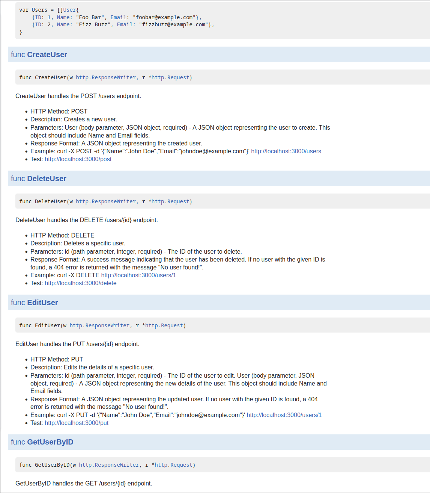
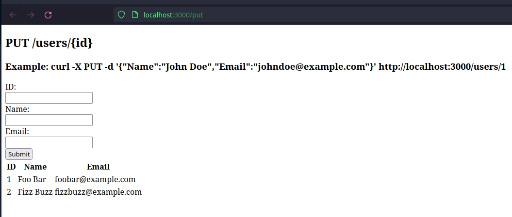

I am using godoc to generate the documentation and I have also added small html files to be able to test the APIs from the doc:

When you click on the test links, a new form will open with the respective test:

I have also created a footer with the in-memory data base so the data is always visible and the changes can be checked. 

I apologize for my basic front end skills :) 